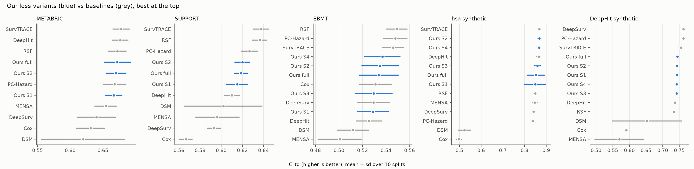
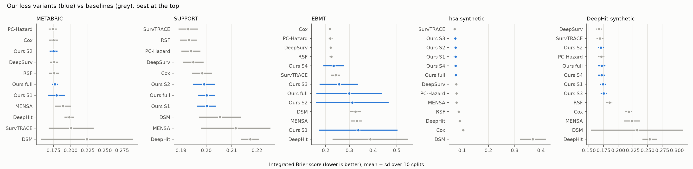

# Version 2 — our loss variants vs. other models

*Results of notebooks 02–06 (5 datasets, 10 random 60/10/30 splits each, mean (sd)). Generated by
`make_report.py` and `make_plots.py` in this folder. The LLM part (notebook 07) is not included.*

## What is compared
**Our model** (transformer, settings tuned on validation in notebook 01), with different losses:

| Name | Losses | Data |
|---|---|---|
| Ours S1 | L_PCH (survival likelihood) | all |
| Ours S2 | L_PCH + L_rank (Eq. 4) | all |
| Ours S3 | L_PCH + L_mul (Eq. 5) | multi-event only |
| Ours S4 | L_PCH + L_rank + L_mul | multi-event only |
| Ours full | survival head with all losses (S2 single-event, S4 multi-event) + regression head with the best-guess loss (R2, Eq. 6) | all |

"Ours full" is one fixed recipe per dataset, decided before looking at test results.

**Datasets:** METABRIC, SUPPORT (real, 1 event), EBMT (real, 4 events), hsa synthetic and DeepHit
synthetic (published synthetic data, 2 events). SEER was planned as an additional large real dataset, but
because of the updated SEER+ data-access policies we could not obtain access to it.

**Baselines** (same splits, each tuned on validation): SurvTRACE (official code), DeepHit, RSF,
PC-Hazard, DeepSurv, MENSA, Cox, DSM.

**Scores:** C_td — how well patients are ranked by risk (higher is better, 0.5 = random).
IBS — how accurate the predicted survival probabilities are (lower is better).
**Bold** = best on that dataset. "—" = needs 2 or more events (L_mul), not defined on single-event data.

### C_td

| Model | METABRIC | SUPPORT | EBMT | hsa synthetic | DeepHit synthetic |
|---|---|---|---|---|---|
| SurvTRACE | **0.678 (0.013)** | **0.638 (0.008)** | 0.546 (0.009) | **0.868 (0.008)** | 0.755 (0.007) |
| DeepHit | 0.677 (0.012) | 0.610 (0.008) | 0.525 (0.011) | 0.865 (0.010) | 0.737 (0.006) |
| RSF | 0.672 (0.014) | 0.636 (0.007) | **0.549 (0.009)** | 0.849 (0.009) | 0.733 (0.005) |
| **Ours full: survival (all losses) + regression head** | 0.672 (0.021) | 0.619 (0.007) | 0.534 (0.017) | 0.852 (0.041) | 0.744 (0.004) |
| **Ours S2: +L_rank** | 0.670 (0.016) | 0.620 (0.007) | 0.535 (0.016) | 0.868 (0.010) | 0.743 (0.004) |
| PC-Hazard | 0.668 (0.017) | 0.627 (0.008) | 0.548 (0.010) | 0.837 (0.008) | 0.762 (0.003) |
| **Ours S1: L_PCH** | 0.667 (0.013) | 0.615 (0.011) | 0.529 (0.013) | 0.849 (0.049) | 0.743 (0.003) |
| MENSA | 0.654 (0.017) | 0.596 (0.021) | 0.501 (0.019) | 0.847 (0.014) | 0.570 (0.074) |
| DeepSurv | 0.640 (0.030) | 0.593 (0.007) | 0.529 (0.014) | 0.842 (0.009) | **0.762 (0.002)** |
| Cox | 0.631 (0.022) | 0.567 (0.006) | 0.531 (0.014) | 0.497 (0.013) | 0.591 (0.005) |
| DSM | 0.620 (0.065) | 0.602 (0.037) | 0.512 (0.013) | 0.522 (0.031) | 0.653 (0.104) |
| **Ours S3: +L_mul** | — | — | 0.530 (0.016) | 0.859 (0.015) | 0.742 (0.003) |
| **Ours S4: +L_rank +L_mul** | — | — | 0.537 (0.015) | 0.867 (0.009) | 0.742 (0.004) |

### IBS

| Model | METABRIC | SUPPORT | EBMT | hsa synthetic | DeepHit synthetic |
|---|---|---|---|---|---|
| PC-Hazard | **0.174 (0.006)** | 0.194 (0.004) | 0.219 (0.010) | 0.078 (0.003) | 0.171 (0.005) |
| Cox | 0.175 (0.006) | 0.198 (0.004) | **0.218 (0.009)** | 0.105 (0.002) | 0.218 (0.006) |
| **Ours S2: +L_rank** | 0.175 (0.006) | 0.199 (0.004) | 0.313 (0.153) | 0.075 (0.003) | 0.171 (0.005) |
| DeepSurv | 0.176 (0.006) | 0.195 (0.004) | 0.220 (0.008) | 0.078 (0.003) | **0.167 (0.005)** |
| RSF | 0.176 (0.007) | 0.193 (0.003) | 0.224 (0.009) | 0.087 (0.002) | 0.185 (0.005) |
| **Ours full: survival (all losses) + regression head** | 0.177 (0.005) | 0.200 (0.003) | 0.299 (0.138) | 0.076 (0.005) | 0.172 (0.007) |
| **Ours S1: L_PCH** | 0.179 (0.012) | 0.200 (0.004) | 0.338 (0.165) | 0.075 (0.007) | 0.174 (0.005) |
| MENSA | 0.189 (0.012) | 0.212 (0.014) | 0.331 (0.023) | 0.079 (0.003) | 0.223 (0.014) |
| DeepHit | 0.198 (0.007) | 0.217 (0.004) | 0.388 (0.159) | 0.091 (0.002) | 0.254 (0.012) |
| SurvTRACE | 0.201 (0.033) | **0.193 (0.004)** | 0.242 (0.018) | **0.071 (0.003)** | 0.169 (0.006) |
| DSM | 0.224 (0.067) | 0.205 (0.008) | 0.326 (0.024) | 0.369 (0.049) | 0.232 (0.078) |
| **Ours S3: +L_mul** | — | — | 0.256 (0.082) | 0.074 (0.003) | 0.175 (0.005) |
| **Ours S4: +L_rank +L_mul** | — | — | 0.233 (0.043) | 0.075 (0.003) | 0.172 (0.006) |

## Findings

1. **Our model is competitive, not the best.** On C_td it is in the upper half on every dataset
   but wins none. SurvTRACE is best on METABRIC, SUPPORT and hsa synthetic, RSF on EBMT, DeepSurv and
   PC-Hazard on DeepHit synthetic. Our best variant is behind the best model by 0.000 (hsa synthetic),
   0.006 (METABRIC), 0.012 (EBMT) and 0.018 (SUPPORT, DeepHit synthetic).
2. **L_rank helps a little, everywhere.** S2 ≥ S1 on all five datasets (+0.000 to +0.019). On hsa
   synthetic S2 ties SurvTRACE (0.868). The gains are within the split-to-split spread; only hsa is
   significant (paired Wilcoxon p < 0.05, see `losses_delta_ctd.png`).
3. **The extra losses mainly make training reliable.** With L_PCH alone (S1), one hsa split collapses
   (C_td 0.71) and several EBMT splits are badly calibrated (Brier up to 0.6). With L_rank + L_mul (S4)
   neither happens: EBMT IBS falls from 0.338 to 0.233 and its spread from 0.165 to 0.043
   (`losses_stability.png`).
4. **Adding the regression head costs nothing on survival** when L_rank is used: "Ours full" has the same
   C_td and IBS as S2/S4. Without L_rank, joint training is less stable on hsa synthetic
   (`joint_recipes_hsa_ctd.png`).
5. **Calibration is good.** Our IBS is close to the best on METABRIC, SUPPORT, hsa synthetic and
   DeepHit synthetic, and better than SurvTRACE on METABRIC. EBMT is the exception: our IBS is higher
   and varies between splits, less so with S4.
6. **EBMT is hard for every model** (C_td 0.50–0.55): only 4 categorical features.

## For the paper
| Claim | Supported? |
|---|---|
| Better C_td than the baselines | No — competitive, upper half |
| Well calibrated | Mostly (not on EBMT) |
| L_rank / L_mul improve the model | As stability and calibration; small C_td gains |
| The regression head can be added without harming the survival head | Yes, with L_rank |

## Notes
- The benchmark row of our model in notebooks 02/03 (S1, early-stopping patience 10) is replaced here by
  notebook 05 (patience 30, as the joint models of 06). The two agree within 0.011 C_td.
- Other figures in this folder: `benchmark_ctd.png`, `benchmark_ibs.png`, `encoding_representation.png`,
  `regression_head.png`, `joint_recipes_hsa_harrell.png`.
